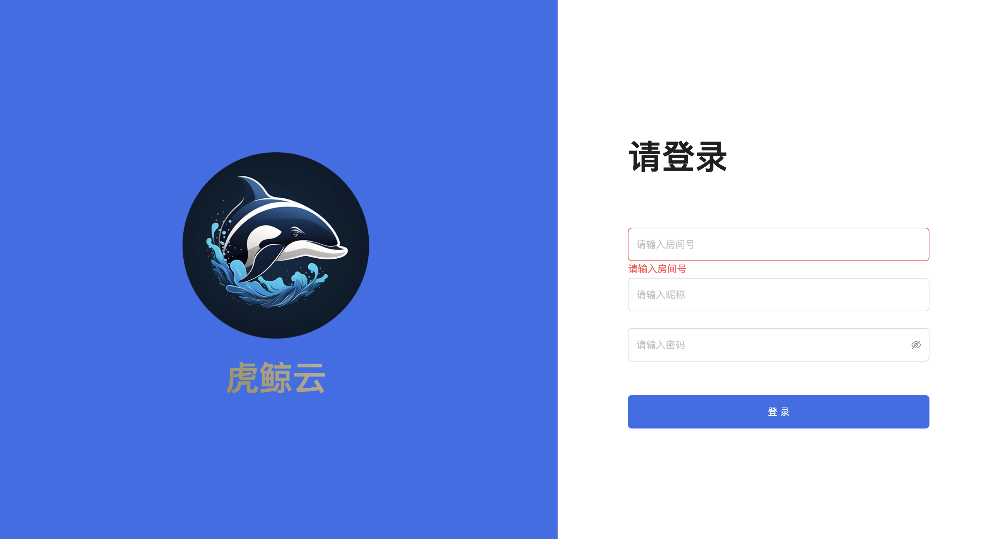
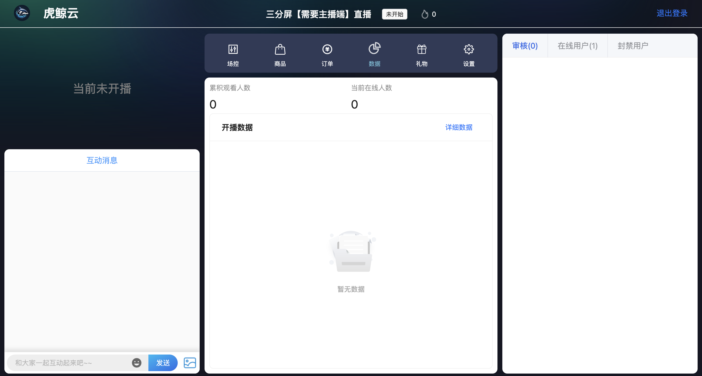

# 虎鲸云 直播助播端

## AD 欢迎大佬们关注公众号 pinkhello 与 🌍 

- 公众号
    
    

- 个人🌍 
    
    

## 项目介绍
 
 > 专注提供私域直播的开源的SAAS解决方案。
 
## 项目组成

- [运营管理端](https://github.com/orca-yun/orca-admin)

- [直播助播端](https://github.com/orca-yun/assis-client)

- [直播主播端](https://github.com/orca-yun/anchor-client)

- [直播观看端](https://github.com/orca-yun/audience-client)

- [直播后端服务](https://github.com/orca-yun/living)

- [基础服务-视频直播](联系+V: beat_ping 索取)

- [基础服务-白板服务](联系+V: beat_ping 索取)

- [基础服务-动弹服务](联系+V: beat_ping 索取)

## Demo 地址
- https://admin.orcacl.com/app/assistant

## 项目功能 🔨

虎鲸云直播助播端

- 互动消息
- 场控
- 商品
- 订单
- 数据
- 礼物
- 设置
- 消息审核
- 在线用户
- 封禁用户
- ...

# 界面展示

 

 

